# Deposit flow contract

This describes the current **demo** deposit modal on `/billing`. The source of truth is `src/App.tsx`; values shared with the UI come from `src/config/constants.ts`. It is a reference for the wallet integration, not a claim that a wallet transaction or backend deposit exists today.

## Stages and transitions

```mermaid
stateDiagram-v2
    [*] --> input: Open deposit modal / reset flow
    input --> input: Change amount, select preset or Max
    input --> approving: Approve Transaction (valid amount)
    approving --> pending: 1.4 s demo timer
    pending --> confirmed: 3.6 s demo timer; demoOutcome = confirmed
    pending --> failed: 3.6 s demo timer; demoOutcome = failed
    failed --> input: Retry deposit
    confirmed --> input: Deposit another amount (reset to 50 USDC)
    input --> [*]: Close, Cancel, backdrop, or leave /billing
    confirmed --> [*]: Close, Cancel, backdrop, or leave /billing
    failed --> [*]: Close, Cancel, backdrop, or leave /billing
```

`approving` and `pending` are busy states: amount, preset, Max, Close, and Cancel controls are disabled, and the close handler refuses to dismiss the modal. The `pending` timer is scheduled when approval starts, so its 1.4-second delay is measured from the click, not from a wallet callback. The final timer is also measured from that click. The stage strip shows the selected demo outcome as its final stage.

Opening from the billing page, a preset, or `/billing?deposit=true` resets the stage to `input`, clears the transaction hash and captured submission, and preserves the current amount unless a preset was supplied. Closing removes the `deposit` query parameter when present. Leaving `/billing` hides the modal; unmounting the app clears scheduled timers.

**Current wiring caveat:** the billing page's “Open deposit modal” button passes `openDeposit` directly as `onClick`. React therefore supplies its click event as the optional `presetAmount`; that path can put a nonnumeric event string into the amount field. Other callers invoke `openDeposit()` or pass a numeric preset explicitly. The wallet integration should wrap the billing click handler so this demo wiring error is not treated as part of the deposit contract.

| Stage | Status banner heading | Status message and visible result |
| --- | --- | --- |
| `input` | “Enter a deposit amount” until valid, then “Review transaction preview” | “Deposit funds to keep premium calls and AI workflows funded without leaving the dashboard.” The preview is editable; invalid input shows a validation message. |
| `approving` | “Approve in wallet...” | “Approve this USDC deposit in your wallet to continue.” The primary button reads “Approve in wallet...” and is disabled. This is a simulated wait; no wallet prompt is opened. |
| `pending` | “Transaction submitted...” | “Transaction submitted to Stellar. Waiting for confirmation.” A shortened transaction hash, copy action, and testnet explorer link appear. The primary button reads “Transaction submitted...” and is disabled. |
| `confirmed` | “Deposit successful” | “{amount} reached the vault. Your balance is updated and ready for API usage.” The demo adds the captured amount to the captured starting vault balance, rounded to two decimals. A success card shows the new balance. |
| `failed` | “Transaction failed” | “The deposit was not confirmed. Review the details, then retry when your wallet is ready.” A failure card says no funds were added and offers **Retry deposit**. |

## Amount and preview rules

The amount starts at `50` USDC. `src/config/constants.ts` defines `MIN_DEPOSIT = 10`, `PRESET_AMOUNTS = [10, 50, 100, 500]`, and the displayed `NETWORK_FEE = "0.00001 XLM"`. The current wallet balance is an in-memory `1260.5` USDC value in `App.tsx`; it is the upper limit, not a constant exported by config. **Max** fills the input with that balance to two decimal places.

The input handler removes every character except digits and periods. Validation then checks, in order: blank input (“Enter a deposit amount to continue.”), non-finite numeric conversion (“Amount must be a valid number.”), an amount below `MIN_DEPOSIT` (“Minimum deposit is $10.”), and an amount above the available wallet balance (“Amount exceeds available wallet balance.”). The submit button is enabled only when none of these messages applies. The handler repeats this guard and rejects clicks while busy. The implementation does not impose a decimal-place limit or separately reject a malformed string if JavaScript converts it to a finite number; the wallet integration should define stricter amount parsing and USDC precision before submission.

The modal's preview shows deposit amount, starting vault balance, projected vault balance, the displayed XLM fee, and total cost. At approval, the amount and starting vault balance are captured so later display and completion use the submitted values. `src/components/DepositPreview.tsx` is a reusable before/after presentation component that also computes a displayed wallet-after value; the active modal renders its own preview markup. Neither preview authorizes a transfer.

## Retry and reset

On failure, **Retry deposit** restores the submitted amount in the input, selects Custom, sets the stage to `input`, and shows “Review the transaction details and approve again.” It does not itself submit a transaction or credit the vault. The previous hash and captured values remain in state but the hash card is hidden at `input`; the next approval replaces them with a new mock hash and captured amount. Editing the amount or selecting a preset calls the full reset, which clears the hash, submission, copy state, and scheduled timers.

After success, **Deposit another amount** calls the full reset with `50` USDC and the matching preset. It keeps the credited vault balance. The demo outcome selector is independent of these resets, so its previous selection persists until changed on the billing page. Closing and reopening resets the flow state but does not undo an already credited demo balance.

## Current mocks and integration boundary

- `createMockHash()` builds a 64-character string from the clock and `Math.random()`. It is created **before** the approving stage, rather than returned by a wallet or network submission. `EXPLORER_BASE_URL` points to Stellar testnet, but a generated hash is not evidence of an on-chain transaction.
- Two `window.setTimeout` calls advance the flow after 1.4 and 3.6 seconds. They do not observe wallet approval, transaction submission, confirmation depth, or a backend response. Starting another approval or a full reset clears pending timers.
- `demoOutcome` is a billing-page toggle between `confirmed` and `failed`; it alone decides the final branch. Success mutates only the in-memory vault balance. The displayed wallet balance is not debited, and reload loses the demo state.
- The XLM network fee is a display constant, not an estimated or charged fee. Clipboard copy and the explorer link are UI actions only.

For a real integration, the wallet/backend boundary must return or report an authoritative transaction identifier and approval/submission result, then track confirmation or failure for that identifier. Only a confirmed deposit should credit a persisted vault balance; a failed, rejected, or timed-out operation must leave it unchanged. The backend must enforce the minimum, available-funds limit, amount precision, and idempotency independently of the UI. The integration must replace demo timers and `demoOutcome` with observed states, handle wallet rejection and network errors deterministically, prevent duplicate submissions while one is in flight, and restore status after reload. Preserve the user-facing stage names and retry/reset behavior unless a deliberate product change updates this contract.
